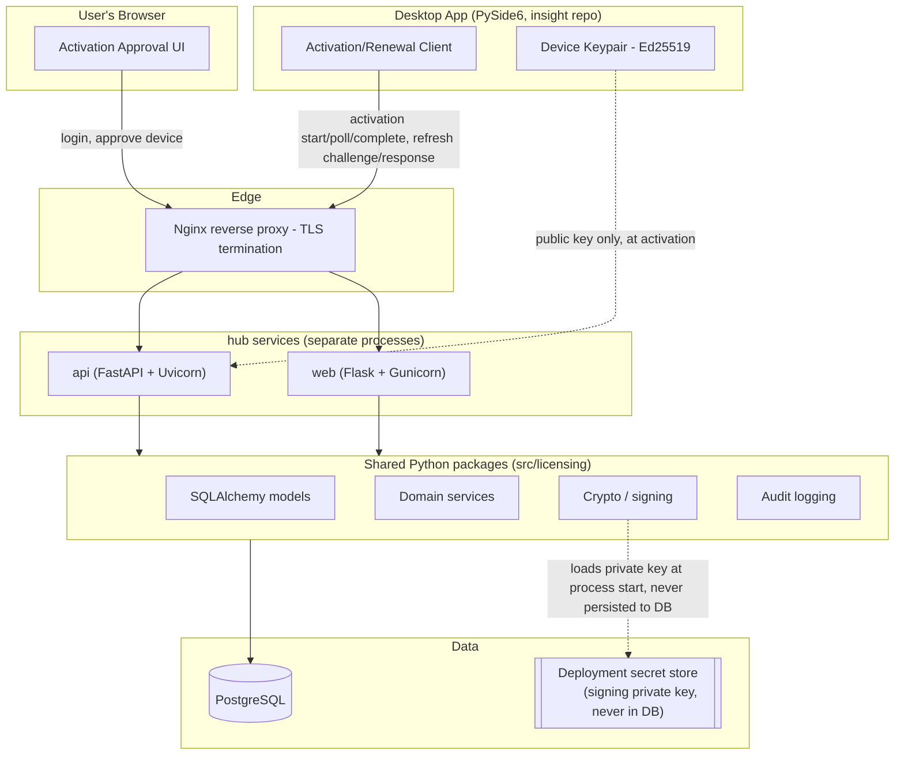

# Architecture — Licensing Control Plane

`hub` is the **vendor cloud licensing control plane** for the deepvac-insight desktop
application. It is strictly scoped to identity, organizations, device
activation, and cryptographic license issuance. Licenses are lifetime grants
issued once at activation — there is no renewal or revocation flow (a
deliberate product decision; see `docs/threat-model.md`). A license entitles
every active member of the organization that owns it to the licensed
product/edition — there is no per-user seat limit or seat-assignment step.

It is **not**, and must never become in this phase, an experiment-data platform. See
[privacy.md](privacy.md) for the enforced boundary.

## Components

## Process separation

* `api` — FastAPI app, desktop-facing, stateless JWT-free polling API.
  Run under Uvicorn workers.
* `web` — Flask app, browser-facing admin portal. Run under Gunicorn.
* Both import the **same** domain models, repositories, and services from
  `src/licensing`. Neither framework contains business logic — routers/views are
  thin adapters that call services and translate to/from Pydantic (API) or
  Jinja/form data (portal).
* `postgres` — single source of truth, one schema, both services connect to it
  (no cross-service HTTP calls needed for this phase).
* `nginx` — TLS termination, reverse proxy to both services on distinct path
  prefixes, trusted-proxy header handling.

No Celery/Redis in Phase A–F of this plan. Rate limiting and challenge TTLs use
Postgres-backed state so the project runs on a single stateful dependency.
The service layer is structured so a queue/cache can be introduced later
(e.g. `src/licensing/services/notifications.py` could be swapped for a task
producer) without changing router/view code.

## Layering rules (enforced by code review + module boundaries)

1. `apps/api/routers/*` and `apps/web/**/views.py` — HTTP-only concerns:
   parsing, auth dependency wiring, status codes, template rendering. No SQL,
   no crypto, no business rules.
2. `src/licensing/services/*` — use-case orchestration (activation,
   org/user/license management). Owns transactions.
3. `src/licensing/repositories/*` — SQLAlchemy queries only, no business rules.
4. `src/licensing/security/*` — Argon2id hashing, Ed25519 signing/verification,
   constant-time comparisons. No knowledge of HTTP or DB.
5. `src/licensing/licensing/*` — canonical payload construction/serialization,
   independent of transport.
6. `src/licensing/audit/*` — audit event recording, with a field allow-list
   that structurally rejects experiment-shaped data (see privacy.md).
