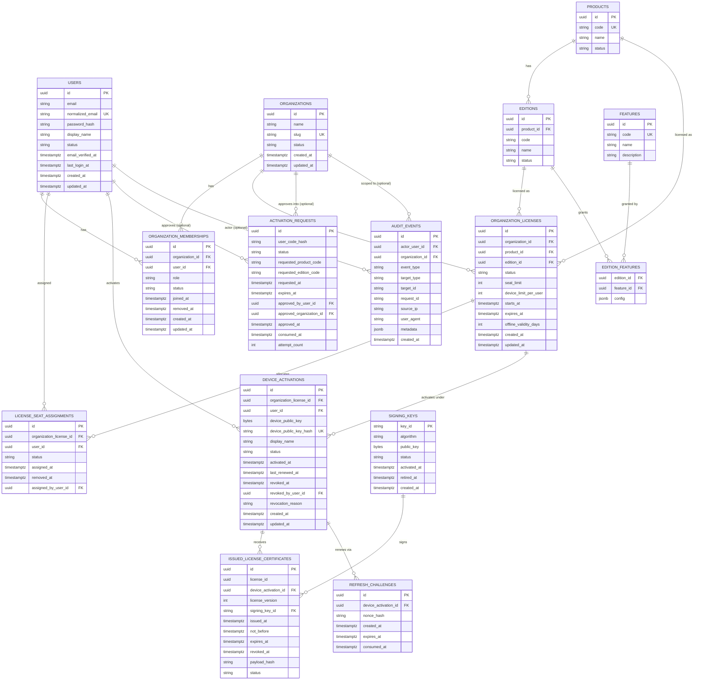

# Database Entity Relationship Model

All timestamps UTC (`timestamptz`). All primary keys are UUIDv4 unless noted.

## Key constraints (DB-level, not just app-level)

* `users.normalized_email` — unique index, lower-cased at write time.
* `organization_memberships` — partial unique index on `(organization_id, user_id)`
  `WHERE status = 'active'` to prevent duplicate active memberships.
* `license_seat_assignments` — partial unique index on
  `(organization_license_id, user_id) WHERE status = 'active'`; seat-limit
  enforcement done via `SELECT ... FOR UPDATE` on the parent
  `organization_licenses` row inside the assignment transaction (see
  `services/seats.py`).
* `device_activations.device_public_key_hash` — globally unique; a device key
  can never be registered twice, satisfying the "duplicate device key" threat.
* `device_activations` — active-device-count-per-user enforced transactionally
  against `organization_licenses.device_limit_per_user`.
* `activation_requests.user_code_hash` — the raw user code is never persisted,
  only its hash (Argon2id or HMAC-SHA256 with a server pepper); lookups hash
  the presented code and compare.
* `refresh_challenges` — unused: this table exists in the schema from an
  earlier design draft that planned a renewal flow. That flow was dropped
  before being built (licenses are lifetime grants — see
  `docs/threat-model.md`), so no code ever writes to this table. Left in
  place as inert scaffolding rather than migrated out.
