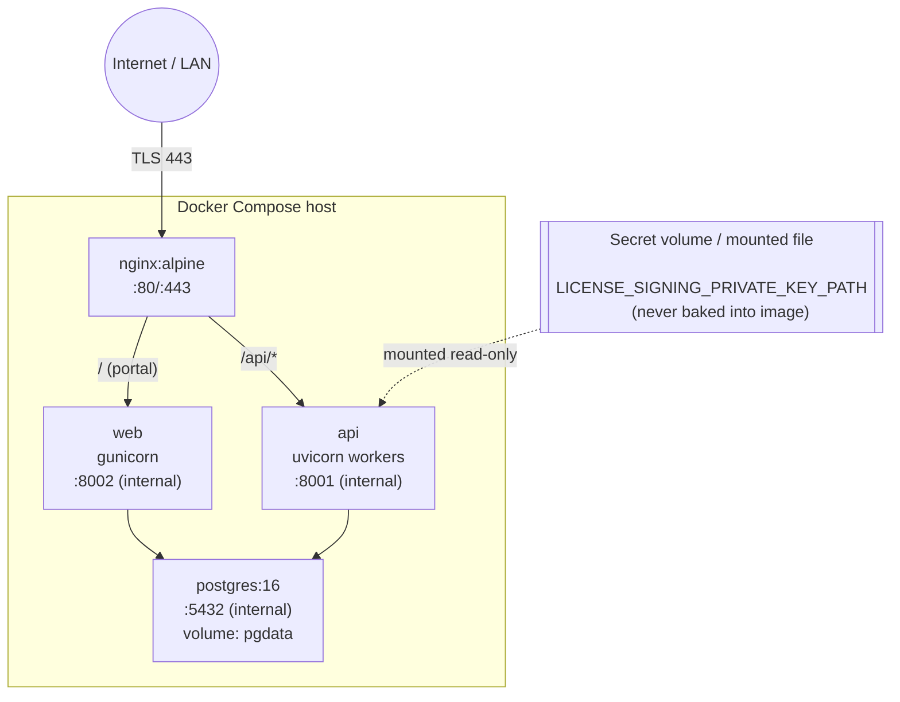

# Deployment Diagram (local/dev topology; production is the same shape behind real TLS + secret manager)

Notes:

* Only `nginx` publishes ports to the host/internet; `api`,
  `web`, and `postgres` are on the internal compose network only.
* `TRUSTED_PROXY_COUNT=1` tells both apps to trust exactly one hop of
  `X-Forwarded-For`/`X-Forwarded-Proto` from Nginx, and no further — prevents
  IP/proto spoofing from clients.
* The signing private key is mounted as a file (bind mount / secret volume in
  dev, a proper secret manager mount in production) — never an environment
  variable dumped into `docker inspect`, never part of the image layers.
* Flask runs under Gunicorn, FastAPI under Uvicorn workers — neither in
  development reload mode in this compose file's default target.
