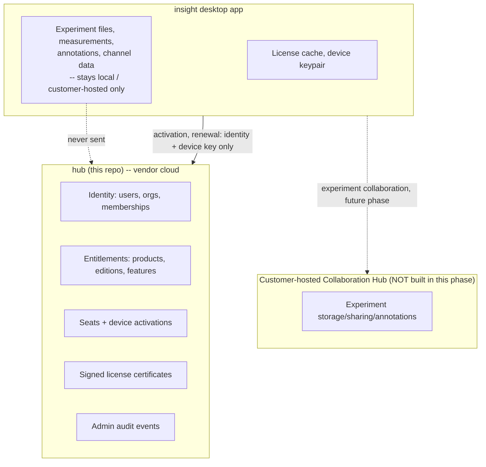

# Privacy Boundary

**This service is a licensing control plane. It is not an experiment-data
platform.** It must never store, request, receive, hash, inspect, or log
experiment files, experiment names, experiment metadata, file paths,
filenames, measurement values, channel names, annotations, experiment
permissions, customer project information, or experiment audit logs. Those
belong exclusively to the customer-hosted Collaboration Hub (a separate,
future, customer-controlled system) and to the desktop application's local
storage.

## Data flow

## Enforced allow-list

`src/licensing/audit/allowlist.py` defines the only field names permitted in
`audit_events.metadata`. Any attempt to log a key outside this list raises at
write time rather than silently persisting it — this converts an accidental
future regression into a hard failure instead of a silent privacy leak.

`tests/security/test_privacy_boundary.py` statically inspects every
SQLAlchemy model and every Pydantic schema in the project and fails the build
if any field name matches a prohibited-term list (`experiment`, `filename`,
`file_path`, `channel`, `measurement`, `annotation`, `project`, ...), and
fails if any new column/field is added to `audit_events.metadata` beyond the
allow-list.

## Logging constraints

* Full request/response bodies are never logged for: authentication
  endpoints, activation endpoints, license refresh endpoints, or password
  endpoints. Structured logs for these routes record only method, path,
  status code, request ID, and timing.
* The license signing private key is loaded into memory once at process
  startup and is never included in any log statement, error message, or API
  response. `src/licensing/security/signing.py` never calls `repr()`/`str()`
  on key material and tests assert this (`tests/security/test_no_key_leak.py`).
* Passwords and raw activation user codes are never logged; only their
  hashes exist server-side, and even those are excluded from ordinary logs
  (only present in the DB row read by parameterized queries).
