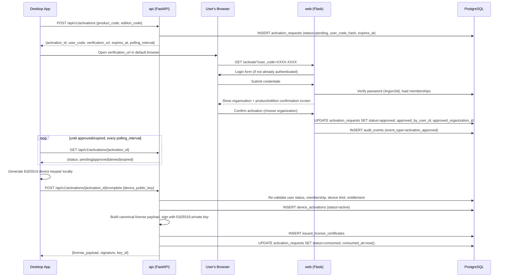

# Sequence Diagrams

## First-launch activation

Key properties: the user code is single-use and short-lived; the browser
session used for approval is never handed to the desktop app — only a signed
license certificate is returned.

## No renewal flow (by design)

Licenses in this product are lifetime grants: `complete_activation` issues a
certificate valid for `OrganizationLicense.offline_validity_days` (defaults
to ~100 years — see README.md's Phase D notes), and the desktop app
(`insight`) never calls back for a fresh one. There is deliberately no
challenge-response renewal endpoint and no device revoke/replace endpoint —
an earlier design draft of this doc described one; it was dropped before
being built once the product decision landed on "lifetime license per
organization, no renewal or revocation." `refresh_challenges` remains in the
schema as inert, unused scaffolding rather than being migrated out.

The practical consequence, stated plainly: once a device activates, there is
no live channel for the vendor to revoke that device's access before its
certificate's own `expires_at` (effectively never, given the default). See
`docs/threat-model.md` threat #13 for the accepted risk this implies.
