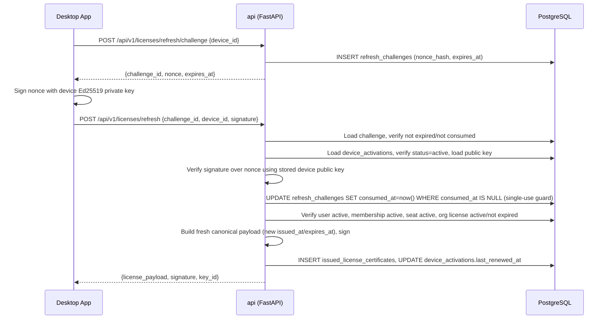

# Sequence Diagrams

## First-launch activation

Key properties: the user code is single-use and short-lived; the browser
session used for approval is never handed to the desktop app — only a signed
license certificate is returned.

## Silent license renewal

No password or browser interaction is required for renewal — trust is rooted
in proof of possession of the device private key plus live server-side status
checks.
