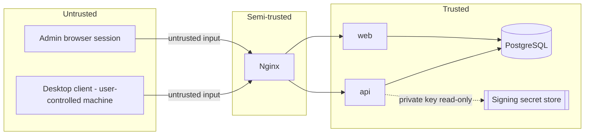

# Threat Model

Scope: the licensing control plane only (this repo). Does not cover the
desktop app's local tamper-resistance or the future customer-hosted
Collaboration Hub.

## Trust boundaries

## Threats and mitigations

| # | Threat | Mitigation |
|---|--------|-----------|
| 1 | Copying a license file to another machine | License is bound to `device_public_key_hash`; a copied file verifies but the desktop client's local proof-of-possession (device signs a local challenge) fails on a machine without the matching private key. Renewal also requires the private key, so a copied static license stops renewing at `offline_validity_days`. |
| 2 | Copying a device public key onto another device's request | `device_public_key_hash` is globally unique in `device_activations`; a second registration attempt with the same key is rejected (see #3). Even if accepted at a point in time, the attacker still lacks the private key needed to sign renewal challenges, so silent renewal fails. |
| 3 | Registering the same device key twice | DB unique constraint on `device_public_key_hash`; service layer returns a conflict error and audits the attempt. |
| 4 | Activation-code guessing | User codes are high-entropy (e.g. 8+ alphanumeric chars from a restricted charset, ~1e12 space), short TTL (default 10 min), rate-limited attempts per IP and per activation_id, `attempt_count` tracked and requests locked after N failures, codes hashed at rest so a DB read doesn't reveal them. |
| 5 | Activation replay (reusing an approved/consumed request) | `activation_requests.status` transitions are one-way (pending→approved→consumed or denied/expired); the complete endpoint checks `status='approved' AND consumed_at IS NULL` and consumes atomically in the same transaction. |
| 6 | License payload modification | Ed25519 signature over canonical bytes; any field change invalidates the signature. Verification is mandatory before the desktop trusts any field. |
| 7 | Refresh-message replay | Challenges are single-use (`consumed_at` set atomically via conditional UPDATE), short-lived, and bound to one `device_activation_id`; a captured challenge/signature pair cannot be replayed after consumption or expiry. |
| 8 | Stolen administrator session | HttpOnly + Secure + SameSite cookies, session fixation prevented by rotating session ID at login, short session lifetime + idle timeout, CSRF tokens on state-changing forms, audit log of all admin actions to detect anomalous use, ability to force-disable an account. |
| 9 | Cross-organization access | Every management-portal query is scoped by the acting user's organization memberships and role; organization_admin/member roles cannot query or act on another organization's data; enforced in the service layer, tested explicitly (see tests/security). |
| 10 | Database compromise | Passwords stored as Argon2id hashes (not reversible); license signing private key is **not** in the database at all, so DB compromise alone cannot forge new licenses (only read existing metadata); audit log helps detect the breach's blast radius. |
| 11 | Signing-key compromise | Key rotation supported (`signing_keys.status`, `key_id` in every certificate and envelope); compromised key is marked retired, a new key is activated, desktop clients pin trusted public keys so a server-side-only compromise of the DB can't silently swap in a rogue key without also compromising the deployment secret store; revoke outstanding certificates issued under the compromised key via `issued_license_certificates.revoked_at` and force renewal. |
| 12 | Malicious desktop client (patched to skip checks) | Out of scope for cryptographic prevention — no client-side check is un-patchable. The server remains the enforcement point for seats/devices/entitlements at every renewal; a patched client can only extend trust in *itself*, which does not affect other users' seats, and revocation still cuts off future renewals server-side. |
| 13 | Complete offline license bypass | Explicitly acknowledged limitation: while `not_before <= now <= expires_at` holds locally and the signature verifies, a device can operate offline up to `offline_validity_days`. This is a deliberate usability/security tradeoff, not a bypass of the signature — it bounds the blast radius of a stolen/shared license to a configurable window, after which renewal (requiring live server contact) is mandatory. |

## What this system is designed to achieve

* Prevent **casual** license copying (a plain file/key copy without the
  private key is insufficient for ongoing use).
* Cryptographically identify each activation to a specific device keypair.
* Enforce seat and device limits transactionally, resistant to races.
* Support fast, auditable revocation (device, seat, or whole license).
* Make abuse patterns (many activation attempts, many devices, replayed
  challenges) detectable via audit events and rate limits.

## What this system explicitly does not claim

* It does not make the desktop application itself immune to patching,
  debugging, or local key extraction by a sufficiently motivated attacker
  with full control of their own machine. No cloud licensing service can
  guarantee that for software the attacker fully controls at the OS level.
