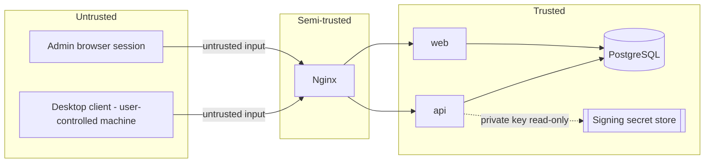

# Threat Model

Scope: the licensing control plane only (this repo). Does not cover the
desktop app's local tamper-resistance or the future customer-hosted
Collaboration Hub.

## Trust boundaries

**Product decision (post-Phase-D): licenses are lifetime grants, not
subscriptions.** There is no renewal endpoint and no device revoke/replace
endpoint — see README.md's Phase D notes. This is a deliberate scope cut,
not a deferral, and it materially changes several threats below versus an
earlier draft of this document that assumed a renewal flow would exist.
Read threats #1, #7 (removed), #11, #12, and #13 with that in mind — they
describe the *actual*, narrower protection this system provides now, not
the stronger one a renewal-based design would have.

## Threats and mitigations

| # | Threat | Mitigation |
|---|--------|-----------|
| 1 | Copying a license file (`license.json`) to another machine, without the device's private key | The payload is bound to `device_public_key_hash`; the desktop client recomputes this hash from its *local* private-key file and compares it before trusting the payload. A `license.json` copied alone (without `device_private_key.bin`) fails this check on the new machine, since a fresh install has no matching key. **If both files are copied together, the clone succeeds** — see #13, this is the accepted residual risk of dropping renewal/revocation. |
| 2 | Copying a device public key onto another device's activation request | `device_public_key_hash` is globally unique in `device_activations` (DB constraint, see #3); a second activation attempting to register the same public key is rejected regardless of which physical device sent the request. |
| 3 | Registering the same device key twice | DB unique constraint on `device_public_key_hash`; service layer returns a conflict error and audits the attempt. |
| 4 | Activation-code guessing | User codes are high-entropy (e.g. 8+ alphanumeric chars from a restricted charset, ~1e12 space), short TTL (default 10 min), rate-limited attempts per IP and per activation_id, `attempt_count` tracked and requests locked after N failures, codes hashed at rest so a DB read doesn't reveal them. |
| 5 | Activation replay (reusing an approved/consumed request) | `activation_requests.status` transitions are one-way (pending→approved→consumed or denied/expired); the complete endpoint checks `status='approved' AND consumed_at IS NULL` and consumes atomically in the same transaction. |
| 6 | License payload modification | Ed25519 signature over canonical bytes; any field change invalidates the signature. Verification is mandatory before the desktop trusts any field. |
| 8 | Stolen administrator session | HttpOnly + Secure + SameSite cookies, session fixation prevented by rotating session ID at login, short session lifetime + idle timeout, CSRF tokens on state-changing forms, audit log of all admin actions to detect anomalous use, ability to force-disable an account. |
| 9 | Cross-organization access | Every management-portal query is scoped by the acting user's organization memberships and role; organization_admin/member roles cannot query or act on another organization's data; enforced in the service layer, tested explicitly (see tests/security). |
| 10 | Database compromise | Passwords stored as Argon2id hashes (not reversible); license signing private key is **not** in the database at all, so DB compromise alone cannot forge new licenses (only read existing metadata); audit log helps detect the breach's blast radius. |
| 11 | Signing-key compromise | Key rotation supported (`signing_keys.status`, `key_id` in every certificate and envelope) — a new key can be activated so all *future* issuance uses it. Retiring the compromised key stops new certificates from using it, but **does not invalidate certificates already signed with it**: `list_public_keys()` deliberately keeps serving a retired key as long as any active certificate still references it (so already-activated installations keep working through rotation), and there is no renewal call that would ever move an installation onto the new key. Recovery from a compromised signing key therefore requires manual intervention (e.g. marking affected certificates' `issued_license_certificates.revoked_at`, which is recorded for audit purposes but — per #12 — has no live enforcement path to an already-running desktop install). |
| 12 | Malicious or cloned desktop client (patched to skip checks, or a legitimate install's `data/license/` directory copied wholesale) | Out of scope for cryptographic prevention beyond #1/#13 — the server has **no live channel** to an already-activated installation (no renewal, no revocation check-in), so once issued, a certificate is trusted for its full validity window regardless of anything that happens server-side afterward. The only server-side lever left is blocking *new* activations (disabling the user/org, or the account that would approve one) — already-activated devices are unaffected. This is the direct, accepted tradeoff of the "lifetime license, no renewal" product decision. |
| 13 | Long-lived / effectively permanent license validity | `offline_validity_days` (baked into each certificate's `expires_at` at issuance) defaults to ~100 years, since this product has no renewal flow to periodically re-validate against. This is a deliberate business decision, not an oversight: a stolen or shared `license.json` + matching device private key remains fully usable for the certificate's entire validity window with no way for the vendor to cut it off remotely (see #12). The only mitigation is upstream of activation — controlling who gets an activation code approved in the first place (active org membership + per-user device limit, enforced at `/activations/{id}/complete`) — not anything after the fact. |

## What this system is designed to achieve

* Prevent **casual** license copying (a plain file copy without the
  matching device private key is insufficient — see #1).
* Cryptographically identify each activation to a specific device keypair.
* Enforce the per-user device limit transactionally, resistant to races, at
  the moment of activation. Entitlement itself is membership-based (any
  active member of the licensed organization qualifies) — there is no
  separate seat limit to enforce.
* Make abuse patterns (many activation attempts, many devices) detectable
  via audit events and rate limits, before an activation completes.
* Let a vendor stop *future* activations for an organization or user at
  any time (disable the account/membership).

## What this system explicitly does not claim

* It does **not** provide any way to revoke or expire an *already-activated*
  device's access early — see threats #12/#13. This was a deliberate
  product decision (lifetime licenses, no renewal/revocation flow), not an
  oversight; if a future requirement needs it, it would require adding a
  live check-in call from the desktop client, which does not exist today.
* It does not make the desktop application itself immune to patching,
  debugging, or local key extraction by a sufficiently motivated attacker
  with full control of their own machine. No cloud licensing service can
  guarantee that for software the attacker fully controls at the OS level.
